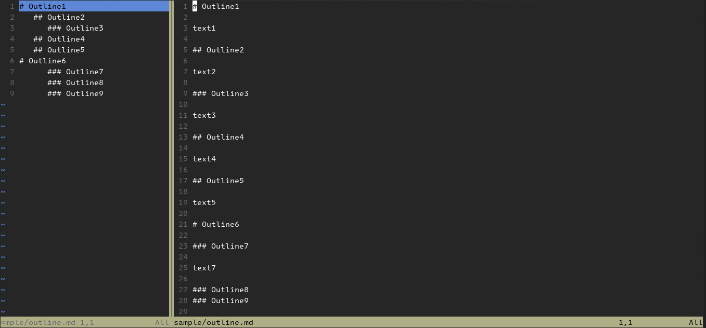

# Vim markdown TOC sidebar

A Vim/Neovim plugin that shows a Markdown file's table of contents in a sidebar (left or right).

Markdownファイルの目次を左右どちらかのサイドバーに表示するVim/Neovimプラグイン。



## Installation.

Use your favorite plugin manager or the built-in package support.

好きなパッケージマネージャーか、組み込みのパッケージ機能を使ってください。

## Usage.

English.
1. Open markdown file (`$vim file.md`, `$nvim file.md`).
2. Run `:OpenMdToc`.
3. if you want to close the TOC sidebar, run `:CloseMdToc`.

Japanese.
1. マークダンファイルを開く(`$vim file.md`, `$nvim file.md`)。
2. `:OpenMdToc`を実行する。
3. TOCを閉じたい場合、`:CloseMdToc`を実行する。

## Commands.

```
" 目次を開く。
:OpenMdToc

" 目次だけを閉じる。
:CloseMdToc

" 目次を更新する。
:RefreshMdToc

" 目次ウィンドウをmarkdownウィンドウの隣に並べ直す。
:AlignMdToc
```

## Config.

:RefreshMdTocを使用し、変更した設定を即座に反映させることができる

```
" 目次サイドバーを開く側を指定する("left"または"right")。既定値: "right"。
let g:vtms_toc_side = "right"

" 目次サイドバーの幅。既定値: 32。
let g:vtms_toc_width = 42

" 見出しの階層を示すために、階層毎に挿入する半角スペースの数。既定値: 3。
let g:vtms_hierarchy_spaces = 2

" "#"を非表示にする。既定値: v:false。
let g:vtms_hide_hashes = v:true

" 目次を閉じた時、対応するmarkdownも閉じるかどうか。既定値: v:false.
let g:vtms_close_markdown_with_toc = v:true
```

## Shortcuts/mappings.

Markdownと目次との間でフォーカスを切り替える。

```
" Example mapping
nnoremap <silent><Leader><Leader> <plug>(vmts-go-to-pair)
```

自分用のコマンドに置き換えできる。

```
" Map :OpneMdToc to :Ot
command Ot OpenMdToc
```
